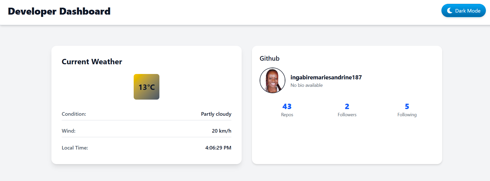

Developer Dashboard

A modern and responsive React application that displays real-time developer data, including GitHub statistics and weather information, with support for Light/Dark mode switching. Built using React, Tailwind CSS, and public APIs

Project Overview

The Developer Dashboard helps developers view important information in one place — GitHub profile data (repositories, followers, following) and live weather updates.
It demonstrates skills in:

API data fetching and rendering

State management using React Hooks

Prop drilling and reusable components

Theme switching with persistence

Responsive UI design using Tailwind CSS

Learning Objectives

By completing this project, I achieved the following:

Fetched and displayed dynamic data from public APIs.

Used useState and useEffect hooks for state and lifecycle management.

Implemented Light/Dark mode with localStorage persistence.

Designed a clean, responsive dashboard layout with Tailwind CSS.

Practiced Git version control with clear commit history and deployment.

Features

 GitHub Profile Card (fetched from GitHub API)
 Weather Card (fetched from a public Weather API)
 Light/Dark Mode Toggle (persistent theme)
 Responsive design across all devices
 Modular and reusable components

 APIs Used

GitHub API: 

Weather API:

Technologies Used

React.js – Frontend framework

Tailwind CSS – Styling and responsive design

Fetch API  – Data fetching

Vite – Development environment and build tool

Components

The project includes the following main components:

Navbar – Displays title and theme toggle button

GitHubCard – Shows GitHub profile data

WeatherCard – Shows live weather info

App – Handles overall layout, theme state, and API integration

deployed Link:https://developer-dashboard-three.vercel.app/

